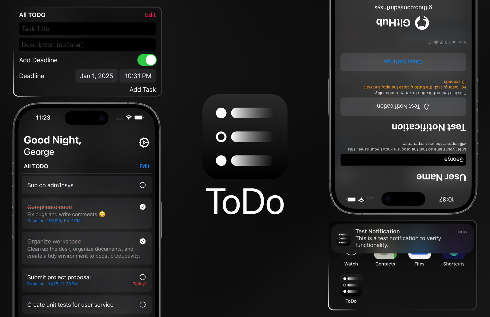

<h1>ToDo</h1>
<h2>Features</h2>
<ol>
  <li>Task Title.</li>
  <li>Task Description.</li>
  <li>Deadline <em>(optional)</em>.</li>
  <li>Notifications  <em>(if has <b>deadine</b>)</em>.</li>
  <li>Test notifications.</li>
  <li>User name.</li>
  <li>Greetings depending on the time.</li>
  <li>Adaptive design.</li>
  <li>Dark and Light Mode.</li>
</ol>
<h2>Language</h2>
<ul>
  <li>Swift Ui</li>
</ul>
<h2>OS</h2>
<ul>
  <li><b>iOS:</b> 14+</li>
  <li><b>iPad OS:</b> 14+</li>
  <li><b>Mac OS (Designed for iPad):</b> M1+</li>
  <li><b>Vision OS (Designed for iPad):</b> 1+</li>
</ul>
<h2>Figma Design <em>(with prototype)</em></h2>
<ul>
  <li><b>SOON</b></li>
</ul>

<b>Created on:</b> 
Xcode Version 15.2 (15C500b) 
Mac OS Ventura Version 13.7.2 (22H313) 
<b>Tested on:</b> 
iPhone SE1 iOS 15.7.8<b>(Real)</b>
<b>Tested on <em>(using simulator)</em>:</b> 
iPhone 15 Pro iOS 17.2 
<b>Xcode Simulator: 
Version 15.2 (1019) 
SimulatorKit 937 
CoreSimulator 944.5 
